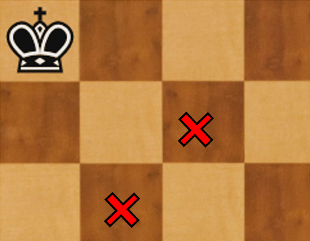

# Ahogado

Es difícil de entender, por eso hay que repetirlo muchas veces para que los alumnos se familiaricen.

Empezamos con un ejemplo fácil de ahogado.

El rey debe mover y no lo puede hacer porque cualquier movimiento que haga es ilegal, se pone en jaque. Por lo tanto está ahogado,  ya que:

* 1, no le están dando jaque,
* 2, el rey no tiene movimiento legal para hacer.

Es necesario además que el bando ahogado no tenga ninguna otra pieza que sí pueda mover.

Si el negro tuviera cualquier otra pieza o un peón en el tablero, y lo pudiera mover, ya no sería ahogado. Únicamente es ahogado si sólo puedo mover el rey, no me están dando jaque y cualquier jugada que haga es ilegal.

Si el rey está en la esquina hay que tener cuidado y no poner la dama a salto de caballo para no ahogarlo.

>**tip**
>**Ejercicio** - Rey negro en a8. ¿Dónde **NO** tengo que poner la dama blanca? **Db6** y **Dc7** ahogan.

>
