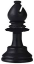
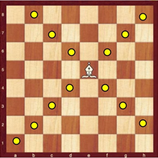
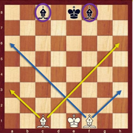
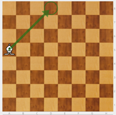

# Alfil

Presento el Alfil (A).

Primero, como se mueve: en diagonal, siempre por el mismo color.

Se dispone de dos alfiles: Uno va por casillas blancas y otro por negras. Para los más peques les podemos contar que uno es el alfil de día (solo va por casillas blancas) y otro es el alfil de noche (sólo va por casillas negras)

**NOTA**: Hay que tener cuidado porque es fácil que los niños pierdan la línea y acaben con dos alfiles que van por el mismo color.

|||
|---|---|

El alfil captura como mueve. Cuanto más centrado está más casillas domina.

Hay que hacer muchos ejercicios de rebote para que los niños no se tuerzan y sigan bien las diagonales.

1. Con el alfil en la mano, desplazarlo por el tablero hasta llegar a una banda. Va rebotando como si fuese una bolita de billar. Nunca cambia el color de la diagonal por la que se mueve.
1. El mismo ejercicio de rebote: el alfil colocado en una casilla de banda del tablero, pero sin moverlo. El alumno dice las casillas en las que rebota. El alfil es sólo una apoyo visual.
1. El mismo ejercicio, sin el apoyo visual del alfil: Se dice de qué casilla parte, pero no se coloca en el tablero. El alumno dice las casillas en las que rebota.

**OBERVACIÓN**: Se trabaja de lo concreto a lo abstracto. Cada vez se convierte más en un trabajo de visualización.

Ejercicio - El tablero es una mesa de billar y el alfil es una bolita. Alfil blanco en a4. ¿Dónde rebota? En d8, h4 y e1.

||||
|---|---|---|

>**tip**
>**Ejercicio** - Alfil negro en f8, peones blancos en a7, b4, d2, e4, f6 y g3. Hay que comerse todos los peones. Hay uno en casilla blanca por lo que no me puedo comer todos.

>

Siempre se debe colocar un peón en color contrario al del color por el que se mueve el alfil. El objetivo es hacer conscientes a los niños de que falta un alfil: se necesita uno de blancas y otro de negras.

>**tip**
>**Ejercicio** -  Los dos alfiles del blanco. Marcamos su posición en el tablero y el niño coloca peones que los alfiles deben comerse. Por parejas, un niño mueve y el otro hace de juez. Luego cambian sus funciones.

>

**NOTA**: Cuando en una partida desaparece un alfil, por ejemplo debido a un cambio de alfil por caballo, si el alfil que queda va por casillas blancas, se deberían poner las piezas rivales en negras para evitar que les pueda capturar.

La progresión para los ejercicios de capturar peones con alfiles es la siguiente:

1. Un alfil blanco va a capturar peones negros en un tablero vacío. Los peones no mueven (aún no saben moverlos y siguen siendo sólo referencias).
2. Dos alfiles blancos van a capturar peones negros.
3. Dos alfiles blancos a capturar peones negros con peones blancos estorbando.
4. Dos alfiles blancos a capturar peones negros y dos alfiles negros a capturar peones blancos. Los peones no mueven ni capturan.
5. Dos alfiles blancos a capturar peones negros y dos alfiles negros a capturar peones blancos. Si  se pueden capturar los alfiles entre sí si se da el caso.

>**tip**
>**Ejercicio** - Poner un alfil de tal manera que domine siete casillas.
>
>El tablero es una diana formada por cuatro cuadrados concéntricos. Cuánto más cerca del centro, más activas son las piezas; salvo el caso de la torre, que siempre domina 14 casillas. Hay que sacar el máximo partido a las piezas. Para ello, ¡centralízalas!
>
>En el caso del alfil, domina 7 casillas cuando está en un borde del tablero, pero son 13 las casillas dominadas cuando se coloca en una de las cuatro casillas centrales. ¡Casi el doble!
>
>En ambos casos el jugador dispone de un alfil, pero la diferencia de actividad de la pieza es enorme.
>
>

---
