# Caballo

Presento el Caballo (C).

Es una pieza difícil, por lo que hay que dedicarle mucho tiempo.

El movimiento del caballo es muy curioso. Todo el mundo, aunque no sepa jugar al ajedrez, sabe que se mueve en "L", pero esa no es una buena manera de explicar a los chicos como es el movimiento del caballo; así que, evitaremos decirlo. Aprender a mover el caballo con eles, lleva a tener que calcular todos sus saltos de uno en uno. Es un proceso duro para un aprendiz. Por ello, es preferible acostumbrarse a una visión de conjunto de todos los saltos. Algo que se adquiere poco a poco y con mucha práctica.

El caballo, al contrario que el alfil,  es una pieza que siempre cambia de color: "Está en negro, va a ir a blanco". Hay que convertir en un automatismo el pensar antes de mover el caballo: "Está en ..., va a ...". Como al saltar cambia de color, tenemos que acostumbrar al niño a que sólo piense en casillas del color contrario a la que está. Así su problema es la mitad de grande.

Además, debemos explicar a los chicos que cuando tengo un caballo no puede ir a ninguna de las casillas que tiene alrededor, al revés que el rey. Si elimino esas casillas, el caballo puede ir a todas las siguientes del color contrario.

Un buen ejercicio es colocar un caballo centralizado y pedir a los niños que nos digan las casillas a las que puede ir el caballo.

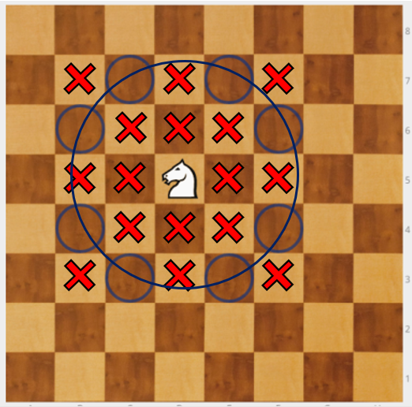

En el diagrama, todas las casillas marcadas con X rojas, indican las casillas a las que no puede ir.

¿Qué nos ha salido? Un círculo alrededor del caballo. Un fallo típico que suelen cometer los niños es marcar alguna de las casillas un poco más fuera. Pero sabiendo que son 8 los saltos posibles, al acabar de marcarlas, se dan cuenta de que les falta una y rectifican y corrigen.

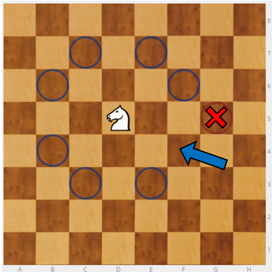

En el ajedrez, los caballos son un arma terrible porque no los ves venir. Hay que saber utilizarlos bien y coger soltura.

El caballo pierde efectividad cuando deja el centro y se ubica en un lateral. Es mejor sacarlo hacia el centro para que tenga 8 movimientos y dominen dos casillas centrales. No es bueno ponerlo en la banda.

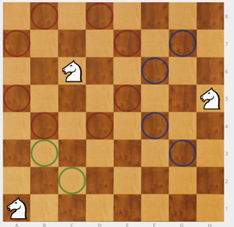

>**tip**
>**Ejercicio** - Por parejas, uno coloca el caballo blanco en cualquier casilla del tablero y el otro los ocho peones negros marcando las casillas a las que puede ir. Este ejercicio lo podemos hacer "contrarreloj", dos veces cada niño, para que traten de superarse.

---

>**tip**
>**Ejercicio** - El caballo blanco en h1 debe llegar hasta h8. El caballo negro en a8 debe llegar hasta a1.

>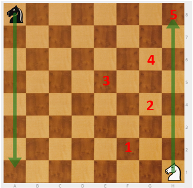

>Hay muchas formas posibles de llegar, la más rápida en 5 movimientos. Se trata de que adquieran soltura en el movimiento del caballo.

Debemos tener en cuenta que no a todos les costará el mismo tiempo. Si unos acaban pronto hay que tenerlos ocupados, por ejemplo, pidiéndoles que lleven sus caballos a otra posición distinta, de h8 a a8 o de h1 a a8.

Si están atascados lo mejor es empezar de nuevo.

**TRUCO**: El caballo, si no va llegar bien, "retrocede" un poquito y salta mejor.

>**tip**
>**Ejercicio** - El caballo blanco en h1 debe llegar hasta g8.

>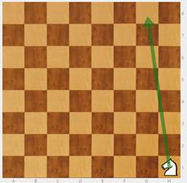

>Hay distintos caminos. Ya tienes una solución, busca otra.

>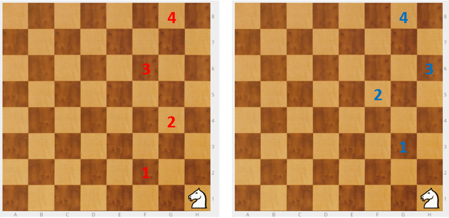

---

>**tip**
>**Ejercicio** - Caballo negro en c6, peón blanco en d5. El caballo tiene que comerse al peón.

>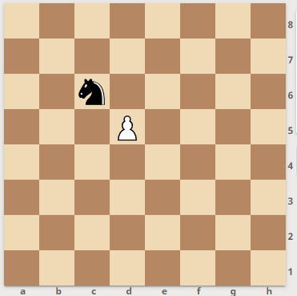

>Dos soluciones: Cc6-e7 y Cd5; Cb4 y Cd5

---

>**tip**
>**Ejercicio** - Caballo negro en e5, peón blanco en d5. El caballo tiene que comerse al peón.

>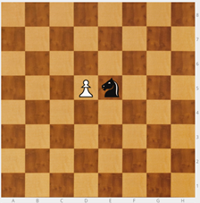

>Algunas soluciones: Cc6, Ce7 y Cd5; Cd3, Cb4 y Cd5; Cd7, Cf6 y Cd5.

Si colocamos el caballo en distintas posiciones respecto al peón, cambia el ejercicio.

>**tip**
>**Ejercicio** - Caballo negro en e5, rodeado de ocho peones blancos en d4, d5, d6, e4, e6, f4, f5 y f6. El caballo debe comerse a todos los peones.

>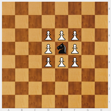

>Como los peones están en las casillas donde no puede ir el caballo, lo primero que habrá que hacer es sacar al caballo del cuadrado. El caballo está en negra, por lo tanto podrá ir a cualquiera de las casillas blancas del exterior del cuadrado.

>A partir de ahí puedo comerme todos los peones seguidos.

>|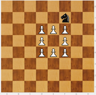|||
>|---|---|---|
>|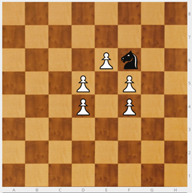|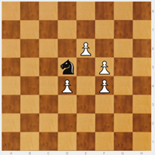||
>||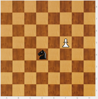||

---

>**tip**
>**Ejercicio** - Caballo negro en d8, cinco peones blancos en c8, c7, d6, e7 y e8. El caballo tiene que comerse todos los peones seguidos.

>

>Hay que empezar sin comer, después capturar primero a uno de los peones marcados en verde c7 o e7. Una solución sería  Ce6, Cc7, Ce8, Cd6, Cc8 y Ce7.

---

>**tip**
>**Ejercicio** - Caballo negro en d8, cinco peones blancos en c8, c7, d7, e7 y e8. El caballo tiene que comerse a todos los peones. En este caso no se los puede comer a todos seguidos.

>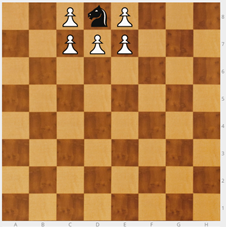

El objetivo de todos estos ejercicios es manejar el caballo con soltura.

>**tip**
>**Ejercicio** - Hacemos un cuadrado de 4 x 4 con los dieciséis peones y colocamos un caballo en una de las cuatro esquinas. Se trata de matar a todos los peones en el menor número de movimientos.

>Podemos hacerlo también con tiempo, usando un cronómetro de Internet que podemos proyectar con el cañón para que cada uno sepa cuánto le ha costado.

>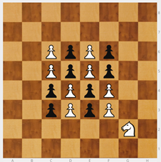

>El número mínimo de movimientos es 17, pero hacerlo en 18 o 19 está bien. Una solución:

>

---

>**tip**
>**Ejercicio** - Situamos peones desperdigados por el tablero y que el caballo salte y se los coma. Los primeros los ponemos fáciles para que el niño vaya cogiendo confianza. Los últimos que le cuesten más.

