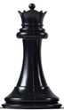
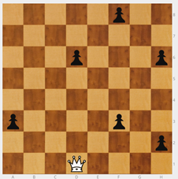

# Dama

Presento la Dama (D).

Se mueve como la torre y  el alfil juntos. Es la pieza más potente. Tiene muchas jugadas posibles.

Cuanto más al centro, más casillas domina.

**NOTA**: Como ya saben mover la torre y el alfil, no es necesario dedicar a la dama mucho tiempo en esta fase, en la que el objetivo es que aprendan a mover las piezas.

Se puede empezar colocando la dama en el tablero mural y peones para que se los vaya comiendo. Mientras tanto, se van haciendo preguntas. ¿Desde la posición en la que está, se puede capturar algún peón? ¿Cuál? Debe haber peones que no se puedan comer directamente para que tengan que maniobrar. En dos jugadas, la dama llega a cualquier casilla y realiza la captura.

Sin embargo, es importante que se realicen ejercicios de jaque. Son rápidos, necesarios y atractivos para los alumnos.

>**tip**
>**Ejercicio** - Rey blanco en e6, dama blanca en g5 y rey negro en e8\. ¿Cuántos jaques hay?

>

>Puedo dar 6 jaques: Dh5, Dg8, Dg6, De7, Dd8 y Db5.

El objetivo es que los alumnos empiecen a ver. No veo todo pero a medida que me voy formando veo más. Es importante que no se conformen con ver una solución.

Los alumnos deben ser conscientes de que no todos los jaques son iguales.

**NOTA**: Preguntar ¿Cuál es el peor de los 6 jaques? (Dd8) resulta una pregunta sorprendente, que no suele ni plantearse, pero que es importante para que el alumno tome conciencia de que hay jaques seguros y jaques malos en los que puedo perder la pieza que ataca. ¿Por qué era mala?¿Cuál crees que es el jaque más difícil de ver? Es otra pregunta que les sorprende. Db5+ tiene un mérito extra, pues está fuera de la zona en la que se dan todos los demás jaques. Para los alumnos que la han encontrado, es una motivación extra saber que era difícil y han sido capaces de verlo.

¿Qué jaques son los mejores? ¿Por qué? Debe dar pie a explicar los mates de pasillo (Dg8++) y el importante mate del “Beso de la muerte” (De7++), que los jugadores van a emplear muchísimo en sus partidas.

>**tip**
>**Ejercicio** - Dama blanca en d1, seis peones negros en a3, d6, f3, f8, h2 y h6\. La dama tiene que comerse todos los peones en seis movimientos.

>

>Hay dos soluciones: f3 - f8 - h6 - h2 - d6 - a3, d6 - a3 - f3 - f8 - h6 - h2.

---

>**tip**
>**Ejercicio** - Tres peones blancos en a3, f1 y h6\. Hay que buscar las posiciones de una dama negra que ataque a los tres peones a la vez. Cuatro soluciones: a6, c1, f8 y h3.

>|||
|---|---|

La dificultad no es encontrar una solución, sino ver TODO. Hay que decirle al niño que no se conforme con una solución.