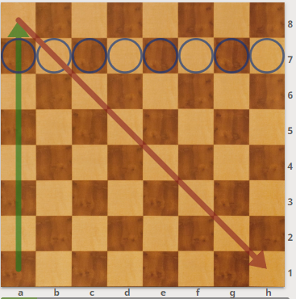
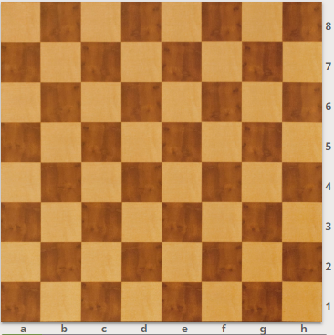
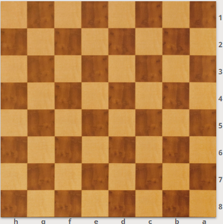
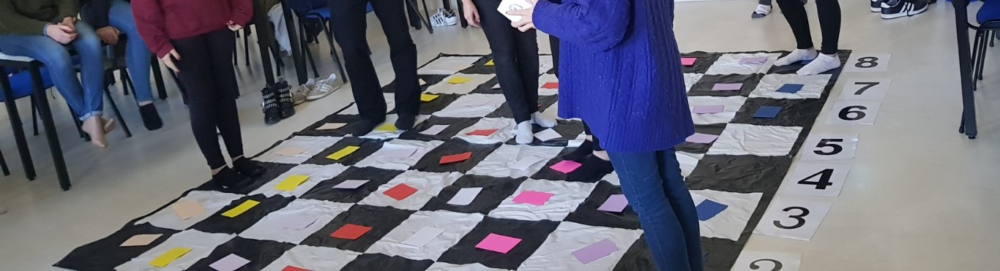

# El tablero de ajedrez

Después de presentar las piezas pasamos a presentar el **tablero**. Todas las casillas tienen nombre que está formado por una letra (columna) y un número (fila). Para marcar casillas en el tablero mural podemos usar imanes.

Marcamos columnas, filas y diagonales. Para los más pequeños utilizamos el tablero de suelo y marcamos con folios de colores columnas, filas y diagonales y así puedan recorrerlas.

Preguntamos el nombre de unas cuantas casillas que señalamos en el tablero. Si lo dicen al revés, número antes que letra, les decimos: _Muy bien, te hemos entendido. Pero...Los buenos dicen e4 y como nosotros vamos a ser buenos, lo diremos cómo los buenos_.

Es importante que se den cuenta que si se ponen en el lado de las blancas la primera fila es la 1 y si están en el lado de las negras la primera fila es la 8.

>**info**
>**Juego - El hotel**: Llegamos a un hotel y nos dan una habitación con letra y número (será cada una de las casillas) y debemos dejar nuestra maleta en la habitación. Para ello buscaremos el ascensor (columna) que nos lleve a ella. Este juego es muy recomendable tanto para los alumnos de EI como para los de los primeros cursos de EP.
>
> Siempre la letra primero. Debemos mentalizar a los chicos de que van a ser buenos. Si dicen primero el número al nombrar una casilla: "Lo has hecho bien, pero recuerda: Los buenos dicen primero la letra. Cómo tú vas a ser bueno...". Es importante que desde el principio el niño sienta que progresa, que va bien y que va a ser bueno.

---

>**info**
>**Juego - Los pistoleros**. Es un juego por parejas. Consiste en señalar casillas. El profesor dice el nombre de una casilla y el primero que la señala en su tablero, gana un punto.
>Para evitar confusiones, cuando nombramos la letra de las casillas, es conveniente decir: f de "feo", g de "gato"...,. Como los alumnos de infantil aún no conocen las letras podemos sustituirlas por ideogramas. Es un ejercicio con el que captamos su atención al 100%, con el que se lo pasan bien y piden más. Conseguimos que se muevan en la dirección adecuada. Cuando llevamos varias pregunta, giramos el tablero para que el alumno que haya estado viendo el tablero desde negras, cambie a verlo desde blancas. Y ya veréis como cambia… Desde blancas se ve un poquito mejor y es más fácil localizar las casillas. Con el giro, la percepción es diferente, todo está cambiado.

---

>**info**
>**Juego - Blancas o  negras**. EL profesor nombra una casilla y los alumnos tienen que decir el color. Si es blanca doy una palmada y si es negra doy la palmada sobre la mesa o las piernas. Deben buscar con los ojos la casilla y no meter las manos en tablero.
