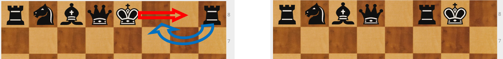

# 3º Movimiento especial: Enroque

* **Es una jugada de rey** en la que se mueven el rey y la torre. El rey mantiene el color en el que está y la torre pasa por encima y se coloca a su lado. El rey siempre se acerca dos casillas a la torre.

El enroque es el único movimiento del ajedrez en el que puedo mover dos piezas. Para ello se deben dar las **siguientes condiciones**:

* No debe haber ninguna pieza entre el rey y la torre con la que quiero enrocar. Las piezas han tenido que salir.
  

* No puedo haber movido el rey. Aunque luego vuelva a su casilla inicial, ya no puede enrocar.

* No puedo haber movido la torre con la que quiero enrocar, aunque haya vuelto a su lugar. Si solo he movido una torre, puedo enrocar con la otra.

* El rey no puede estar en jaque. Si está en jaque, no puedo enrocar.

* No puede pasar el rey por una casilla controlada por mi rival. Se considera que mientras pasa para enrocar, se está poniendo en jaque.

Hay dos enroques: el **enroque corto** (flanco del rey) y el **enroque largo** (flanco de la reina).

En principio, el enroque corto es mejor porque el rey queda más protegido y además el propio rey protege a los tres peones que tiene delante.

Si quiero crear una partida "violenta" enroco al lado contrario al que lo haya hecho mi rival.

Hay niños que no quieren enrocar. Y no es fácil convencerles de que es conveniente. Pero la realidad es que: Si dejo el rey en el centro sin enrocar, poner en juego las torres es complicado; hacerlo avanzando el peón que está delante de la torre no suele ser una buena alternativa. Y si las torres no salen a luchar, se están desaprovechando dos de las piezas más potentes. El enroque pone al rey en seguridad y hace jugar a las torres.

En líneas generales lo mejor es enrocarse en cuanto se pueda.

1º. Desarrolla.

2º. Controla el centro

3º. Enroca.

No hay que retrasar demasiado el enroque, pero puede ser interesante (si no hay un peligro próximo) dejar al rival la duda de por dónde nos vamos a enrocar.

Ya hemos dicho que el enroque es una jugada de rey, por lo tanto, para enrocar tengo que tocar primero el rey, si no el rival puede obligarme a mover la torre y no dejarme enrocar.

**Norma**: para enrocar debo hacerlo con una sola mano y empezando con el rey.

Si ya he movido el rey y no puedo enrocar, aún me queda un recurso: el enroque artificial. Es menos habitual y requiere cuatro movimientos. Se adelanta un peón, se mueve el rey al hueco, se saca la torre y se coloca el rey en su casilla habitual del enroque..

|||
|---|---|
|||
