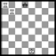
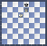
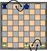

# Evaluación

La evaluación de los alumnos es continua, flexible, sistemática y funcional.

## Recursos para evaluar:

### a. _“Exámenes”_

Un examen de ajedrez puede tener diferentes modelos: tipo test, diagramas, problemas de razonamiento... Lo que el maestro debe buscar es que el alumnos con sus respuestas demuestren que saben aplicar   lo aprendido.

Aparte del tradicional examen escrito, la evaluación oral, a nivel individual o grupal, también puede ser útil, ya sea de forma puntual o bien emplearla en la fase inicial de cada sesión, a modo de repaso de conocimientos PREVIOS necesarios como base  para seguir ampliando con los conocimientos que se vayan a presentar en la sesión. En este caso, si se trata de un grupo, debemos asegurarnos de evaluar a todos y cada uno de nuestros alumnos.

Una tercera vía de estilo examen sería el test sobre el tablero. Individualmente, podríamos poner a prueba a nuestros alumnos planteando ciertas situaciones o problemas sobre el tablero, o bien una partida, para comprobar la asimilación de los contenidos.

>**tip**
>**Ejemplo de ejercicio de “examen”**:

>¿Cuántas piezas hay en el tablero?
>
>¿Cuántas son negras?
>
>Reproduce la posición en tu tablero (si no son capaces volvemos a enseñarles el tablero 1 min)
>
>¿Quién gana?
>
>Si juegan negras: mejor jugada:
>
>Si juegan blancas mejor jugada:

### b. Prácticas por parejas

Es un método muy dinámico y cada vez más utilizado en la enseñanza. Especialmente útil es este tipo de práctica en las primeras sesiones de un curso, en la que el maestro no conozca aún sus alumnos y los tenga que situar en un nivel u otro. Si tiene que hacer sub-grupos, estas dinámicas deben servir como prueba de nivel para definir los grupos de trabajo.

* Simultáneas: Sin abusar, teniendo en cuenta que la diferencia entre el profesor y el alumno debe ser significativa, las simultáneas también ofrecen una visión bastante aproximada del nivel del alumno, de una forma bastante personalizada. Es una herramienta válida tanto al principio del curso como para cualquier otra fase.

* Pequeñas competiciones internas: Una vez que los alumnos tienen un aceptable nivel de juego, se pueden organizar pequeñas competiciones internas que podrían ser sistema liga o torneo que daría pie a elaborar un ranking  que estaría a la vista de todos los participantes, en el pasillo por ejemplo y que variaría en función de las competiciones que se desarrollen.

### c. Fichas de observación

Las utilizamos sobre todo para registrar actitudes y comportamientos en clase. Ejemplo:

| COMPORTAMIENTOS Y ACTITUDES OBSERVADAS | FECHA | FECHA |
| --- | --- | --- |
| Atiende a las explicaciones del profesor |   |   |
| Colabora con sus compañeros cuando trabaja en grupo |   |   |
| Participa en las actividades propuestas |   |   |
| Cuida el material |   |   |
| Recoge el material |   |   |
| Respeta a sus compañeros |   |   |
| Respeta al profesor |   |   |
| Disfruta con las clases |   |   |

### d. Rúbricas

Una rúbrica es un modo sencillo, rápido y consistente de organizar la valoración de una tarea o ejecución; así como de proporcionar retroalimentación a los estudiantes.

Es una tabla de doble entrada que contiene una selección de criterios de evaluación definidos en una escala que expresa un rango de ejecución.

Se definen de modo que representen diferencias cualitativas en términos de aprendizaje. De este modo, las características que señalan la calidad del trabajo / tarea realizada están claramente descritas para cada nivel.

Rúbrica de Evaluación para la enseñanza del Ajedrez a Nivel Básico:

<table>
<tbody><tr class="c93"><td class="c57" colspan="1" rowspan="3">

</td><td class="c9" colspan="1" rowspan="1">
0
</td><td class="c101" colspan="1" rowspan="1">
No realiza correctamente el movimiento del rey en la mayoría de las ocasiones.
</td></tr><tr class="c65"><td class="c82" colspan="1" rowspan="1">
1
</td><td class="c59" colspan="1" rowspan="1">
Mueve el rey y captura de manera correcta, aunque no encuentra los caminos más cortos.
</td></tr><tr class="c71"><td class="c46" colspan="1" rowspan="1">
2
</td><td class="c99" colspan="1" rowspan="1">
Mueve el rey, captura de manera correcta y encuentra los caminos más cortos. 
</td></tr><tr class="c70"><td class="c57" colspan="1" rowspan="4">

</td><td class="c9" colspan="1" rowspan="1">
0
</td><td class="c101" colspan="1" rowspan="1">
No realiza correctamente el movimiento de la torre en la mayoría de las ocasiones.
</td></tr><tr class="c65"><td class="c82" colspan="1" rowspan="1">
1
</td><td class="c59" colspan="1" rowspan="1">
Realiza correctamente el movimiento de la torre y la captura en la mayoría de las ocasiones.
</td></tr><tr class="c74"><td class="c46" colspan="1" rowspan="1">
2
</td><td class="c99" colspan="1" rowspan="1">
Encuentra los mejores caminos y conoce alguna técnica especial de la torre como atacar por detrás a los peones.
</td></tr><tr class="c85"><td class="c89" colspan="1" rowspan="1">
3
</td><td class="c36" colspan="1" rowspan="1">
ES capaz de colocar la pieza de manera que realice un doble ataque.
</td></tr><tr class="c70"><td class="c57" colspan="1" rowspan="4">
&nbsp;

</td><td class="c9" colspan="1" rowspan="1">
0
</td><td class="c101" colspan="1" rowspan="1">
No realiza correctamente el mate de la escalera cuando hay mate en 1.
</td></tr><tr class="c65"><td class="c82" colspan="1" rowspan="1">
1
</td><td class="c59" colspan="1" rowspan="1">
Realiza correctamente el mate de la escalera cuando hay mate en uno.
</td></tr><tr class="c65"><td class="c88" colspan="1" rowspan="1">
2
</td><td class="c1" colspan="1" rowspan="1">
Realiza correctamente el mate de la escalera en diferentes posiciones dadas en la banda superior.
</td></tr><tr class="c74"><td class="c94" colspan="1" rowspan="1">
3
</td><td class="c39" colspan="1" rowspan="1">
Realiza correctamente el mate de la escalera en diferentes posiciones dadas en cualquiera de las bandas.
</td></tr><tr class="c70"><td class="c57" colspan="1" rowspan="4">

&nbsp;

</td><td class="c9" colspan="1" rowspan="1">
0
</td><td class="c101" colspan="1" rowspan="1">
No realiza correctamente el movimiento del alfil por la diagonal en la mayoría de las ocasiones.
</td></tr><tr class="c65"><td class="c82" colspan="1" rowspan="1">
1
</td><td class="c59" colspan="1" rowspan="1">
Realiza correctamente el movimiento del alfil y la captura en la mayoría de las ocasiones.
</td></tr><tr class="c74"><td class="c46" colspan="1" rowspan="1">
2
</td><td class="c99" colspan="1" rowspan="1">
Encuentra los mejores caminos y, conoce y aplica que el alfil domina más casillas cuanto más en el centro está.
</td></tr><tr class="c73"><td class="c89" colspan="1" rowspan="1">
3
</td><td class="c36" colspan="1" rowspan="1">
Es capaz de colocar la pieza de manera que realice un doble ataque.

Distingue ataques seguros de correctos o seguros &nbsp;e &nbsp;incorrectos en donde le pueden capturar 

Discrimina bien entre los alfiles y elige bien qué alfil

debe usar para dar jaque o realizar un ataque
</td></tr><tr class="c70"><td class="c57" colspan="1" rowspan="4">

</td><td class="c9" colspan="1" rowspan="1">
0
</td><td class="c101" colspan="1" rowspan="1">
No realiza correctamente el movimiento de la dama en la mayoría de las ocasiones.
</td></tr><tr class="c65"><td class="c82" colspan="1" rowspan="1">
1
</td><td class="c59" colspan="1" rowspan="1">
Realiza correctamente el movimiento de la dama y la captura en la mayoría de las ocasiones.
</td></tr><tr class="c74"><td class="c46" colspan="1" rowspan="1">
2
</td><td class="c99" colspan="1" rowspan="1">
Encuentra los mejores caminos y realiza besos de la muerte en diagramas de mate en 1.
</td></tr><tr class="c73"><td class="c89" colspan="1" rowspan="1">
3
</td><td class="c36" colspan="1" rowspan="1">
Es capaz de colocar la pieza de manera que realice un doble ataque.
</td></tr><tr class="c70"><td class="c57" colspan="1" rowspan="4">

</td><td class="c9" colspan="1" rowspan="1">
0
</td><td class="c101" colspan="1" rowspan="1">
No realiza correctamente el movimiento de caballo en la mayoría de las ocasiones.
</td></tr><tr class="c65"><td class="c82" colspan="1" rowspan="1">
1
</td><td class="c59" colspan="1" rowspan="1">
Realiza correctamente el movimiento de caballo y la captura en la mayoría de las ocasiones.
</td></tr><tr class="c71"><td class="c46" colspan="1" rowspan="1">
2
</td><td class="c99" colspan="1" rowspan="1">
Encuentra los mejores caminos y, conoce y aplica el concepto de que el caballo en la banda tiene menos actividad que en las casillas centrales.
</td></tr><tr class="c73"><td class="c89" colspan="1" rowspan="1">
3
</td><td class="c36" colspan="1" rowspan="1">
Es capaz de colocar la pieza de manera que realice un doble ataque.
</td></tr><tr class="c70"><td class="c57" colspan="1" rowspan="4">

</td><td class="c9" colspan="1" rowspan="1">
0
</td><td class="c101" colspan="1" rowspan="1">
No realiza correctamente ningún paso del baile de la muerte en ninguna posición dada de las diferentes etapas.
</td></tr><tr class="c93"><td class="c82" colspan="1" rowspan="1">
1
</td><td class="c59" colspan="1" rowspan="1">
Realiza uno o dos de los pasos del baile de la muerte correctamente (salto de caballo, copia, encierre en banda, acercamiento del rey y beso).
</td></tr><tr class="c92"><td class="c88" colspan="1" rowspan="1">
2
</td><td class="c1" colspan="1" rowspan="1">
Realiza tres o cuatro pasos del baile de la muerte correctamente.
</td></tr><tr class="c74"><td class="c94" colspan="1" rowspan="1">
3
</td><td class="c39" colspan="1" rowspan="1">
Realiza correctamente el baile de la muerte en la mayoría de las ocasiones o siempre.
</td></tr><tr class="c70"><td class="c57" colspan="1" rowspan="5">

</td><td class="c9" colspan="1" rowspan="1">
0
</td><td class="c101" colspan="1" rowspan="1">
No realiza correctamente el movimiento del peón en la mayoría de ocasiones
</td></tr><tr class="c65"><td class="c82" colspan="1" rowspan="1">
1
</td><td class="c59" colspan="1" rowspan="1">
Realiza correctamente el movimiento de peón y la captura en la mayoría de las ocasiones.
</td></tr><tr class="c65"><td class="c88" colspan="1" rowspan="1">
2
</td><td class="c1" colspan="1" rowspan="1">
Realiza correctamente el movimiento de peón y la captura, así como la coronación.
</td></tr><tr class="c92"><td class="c88" colspan="1" rowspan="1">
3
</td><td class="c1" colspan="1" rowspan="1">
Es capaz de colocar la pieza de manera que realice un doble ataque.
</td></tr><tr class="c74"><td class="c94" colspan="1" rowspan="1">
4
</td><td class="c39" colspan="1" rowspan="1">
Además realiza el movimiento de captura al paso y conoce estrategias como la cadena de peones o los grupos de islas.
</td></tr><tr class="c112"><td class="c57" colspan="1" rowspan="6">

</td><td class="c9" colspan="1" rowspan="1">
0
</td><td class="c101" colspan="1" rowspan="1">
No realiza correctamente el enroque en la mayoría de ocasiones.
</td></tr><tr class="c93"><td class="c82" colspan="1" rowspan="1">
1
</td><td class="c59" colspan="1" rowspan="1">
Realiza correctamente el enroque en uno de los dos lados sin oposición del rival, teniendo en cuenta no haber movido rey o torre.
</td></tr><tr class="c65"><td class="c88" colspan="1" rowspan="1">
2
</td><td class="c1" colspan="1" rowspan="1">
Realiza correctamente el enroque en ambos lados sin oposición del rival, teniendo en cuenta no haber movido rey o torre.
</td></tr><tr class="c65"><td class="c66" colspan="1" rowspan="1">
3
</td><td class="c109" colspan="1" rowspan="1">
Realiza correctamente el enroque teniendo en cuenta al rival y que el rey no puede cruzar por casillas amenazadas.
</td></tr><tr class="c92"><td class="c66" colspan="1" rowspan="1">
4
</td><td class="c109" colspan="1" rowspan="1">
Realiza el enroque al principio de una partida cuando puede
</td></tr><tr class="c68"><td class="c94" colspan="1" rowspan="1">
5
</td><td class="c39" colspan="1" rowspan="1">
Conoce la regla de no enrocarse cuando está en jaque
</td></tr></tbody></table>
