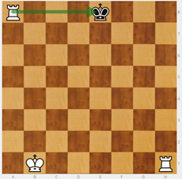
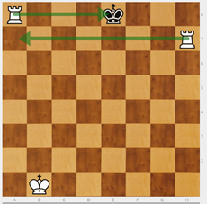
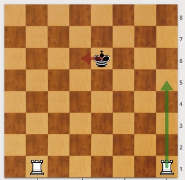
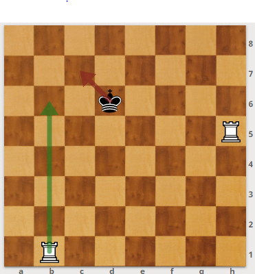
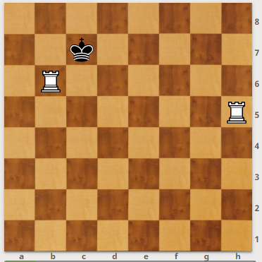
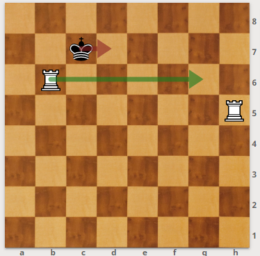
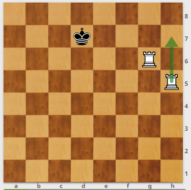
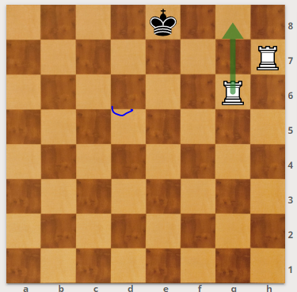
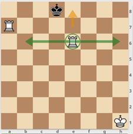

# Jaque y jaque mate

Hay que explicar el concepto de **jaque**: una pieza amenaza capturar al rey. Tan pronto se produce un jaque, hay que salvar al rey del ataque. Si no es posible salir del jaque, es **jaque mate** y la partida acaba.

La torre blanca de a8 amenaza al rey negro: es jaque. El rey puede moverse a d7, e7 y f7.

En un campeonato no se avisa del jaque. Sin embargo, debemos decirle al niño que en el colegio sí que deben avisar. Si no se salva al rey pudiendo hacerlo, se incurre en una jugada **ilegal**.

Si no puedo salvar al rey es **jaque mate**. El rey **no se come**, es la única pieza que no se puede capturar.

La torre blanca de a8 amenaza al rey negro. El rey no tiene ningún movimiento legal: es jaque mate.

Hay que enseñar a los niños a no dar jaques innecesarios: _"Los buenos no dan jaque, se lo guardan para cuando lo necesiten"_.

### Mate de la escalera

#### Con dos torres (o con torre y dama)

El mate de la escalera consiste en llevar al rey hasta un borde del tablero. Para ello las torres trabajan en equipo. Una de las torres corta el paso quitando el mayor espacio posible de tablero. Para cortar el paso debemos colocar la torre en la fila inmediatamente anterior de la que se encuentra el rey.

A partir de ahí simulamos subir una escalera peldaño a peldaño. Nuestras torres son las piernas y el tablero la escalera.

La torre que queda atrás quita la siguiente fila esté o no  el rey rival. Cuando coinciden en la misma fila torre y rey enemigo es jaque. El rey se ve obligado a retroceder a la fila posterior. Hasta que lo llevamos al borde del tablero donde recibe jaque mate porque ya no le queda tablero para huir.

##### Demostración paso a paso:

Primero se corta el paso al rey. Para ello, se coloca una torre en la fila inmediatamente anterior a la que se encuentra el rey.

Después, se da jaque con la torre que está más atrás. Con lo que el rey debe retroceder hacia la banda del tablero. Se trata de obligar al rey a llegar hasta uno de los bordes del tablero.

**_¡ATENCIÓN!_** El rey negro está jugando muy bien. Se ha acercado a la torre y la amenaza. Este es un caso que te va a ocurrir y que debes estar atento para que tu torre no sea capturada. ¿Qué podemos hacer? Nuestra recomendación es que te la lleves lo más lejos posible pero…

**_MUY IMPORTANTE_**: _"Las piezas se ayudan, no se molestan. En clase somos como las piezas, nos vamos a ayudar."_

Si el rey se acerca a la torre y amenaza capturarla, la solución más sencilla consiste en moverla al otro lado en la misma fila, sin dejar de realizar la función de cortar el paso. Se trata de salvar la torre pero sin dejar de cortarle el paso al rey.

Una vez que nuestras torres están seguras seguimos subiendo la escalera, es decir, quitando el siguiente peldaño y obligando al rey a retroceder.

Cuando el rey ha sido empujado a la última fila del tablero el jaque con la torre de atrás supone jaque mate.

El rey no puede evitar el jaque, no dispone de ningún movimiento legal. ¡JAQUE MATE!

##### RECUERDA:

* 1º Decide en qué banda resulta más rápido (o más fácil) encerrar al rey rival. En esa banda darás mate.
* 2º Corta el Paso
* 3º Sigue haciendo que el rey rival retroceda. Para ello, ataca siempre con la torre que ha quedado más atrás.
* Si el rey rival ataca la torre que corta el paso  lleva tu torre bien lejos, sin que deje de realizar la función que hacía.
* Tus piezas cooperan, no se molestan. Si debes cambiar una pieza a otro lado para evitar el ataque del rey, ten presente que no se deben obstruir el paso.

Otro momento de especial cuidado:

Al blanco le gustaría dar jaque con su torre que ha quedado más atrás. Pero si lo hace ¿qué pasa?

Estaría poniendo su torre al lado del rey rival sin proteger, por tanto el rey la capturará y salvaría el jaque mate.¿Qué debemos hacer?

Llevarla lo más lejos posible para continuar con la mecánica de la escalera.

Recuerda que si la vas a llevar cerca de tu otra torre, las piezas del mismo equipo no se deben molestar.

**OBSERVACIÓN**: Resulta curioso comprobar que, con niños que empiezan, si se enseña y practica este mate siempre con dos torres, cuando disponen de torre y dama creen que no pueden realizarlo: les falta la 2ª torre.  
