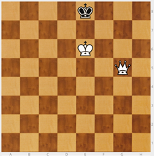
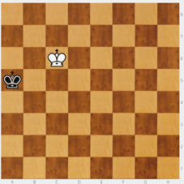
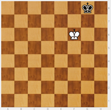

## Mate del beso de la muerte

Ya habíamos visto uno.

**De7** es un **beso de la muerte**. La reina le da un beso al rey contrario y lo mata. Para ello la dama tiene que estar protegida por el rey y situarse justo delante, sino el rey puede escaparse.

**NOTA**: Conviene realizar muchos ejercicios similares, cambiando de banda del tablero, con rey débil en la esquina, con la dama llegando desde diferentes posiciones (no sólo diagonal, como en el ejemplo de muestra)

Para familiar a los chicos con el jaque son buenos los ejercicios de "pieza fantasma".

>**tip**
>**Ejercicio** - Rey blanco en c6, rey negro en a5\. ¿Dónde está la dama blanca para mate? Db5

>

---

>**tip**
>**Ejercicio** - Rey blanco en f6, rey negro en g8\. ¿Dónde está la dama blanca para que dé mate? Dg7

>

La dama tiene que estar delante del rey y defendida.

¿Por qué hay que trabajar mucho este mate? Porque sale mucho en las partidas, lo van a usar mucho y es imprescindible que dispongan de recursos para dar mate y ganar..

A veces, hay alumnos a los que ejercicios, que en principio son sencillos, se les atascan y les resultan difíciles. Esto nos puede ocurrir incluso alumnos que llegarán a ser buenos jugadores. Paciencia, hay que creer en la capacidad del jugador y no menospreciarle por sus dificultades. Acabará superando sus problemas.

Los ejercicios tan útiles e importantes como el mate de beso,  deben ser repetidos muchas veces, en distintos momentos, desde distintos ángulos.

Con la dama no es necesario insistir mucho más, de momento.
