# Mate con Rey y Dama

Un mate que hay que saber dar. Se va a usar con frecuencia.

Hay que hacerlo muy bien y con cuidado para no ahogar al rey contrario.

Si encontramos el rey al borde del tablero, tenemos que encerrarlo cortándole el paso con la dama.

Si está por el centro, 1º habrá que obligarle a mover hacia el borde.  Para ello, la dama se pone a salto de caballo del rey. Si le diera jaque el rey tendría seis sitios dónde ir, pero si la dama se pone a salto de caballo solo permite ir a tres. El rey no puede acercarse a la dama porque se pondría en jaque. A partir de ahí, se hacen con la dama los mismos movimientos que haga el rey rival.

En cuanto el rey rival ocupa una casilla del borde del tablero, se le corta el paso y se le encierra en la banda.  Ya no es necesario el seguir a salto de caballo.

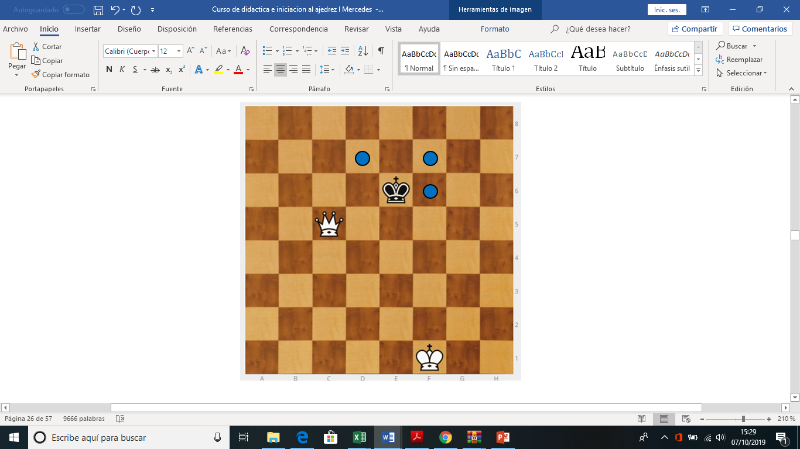

Cuando hemos llevado al rey hasta el borde del tablero le he construido una "jaula" o "cárcel", por la que puede moverse pero no salir.

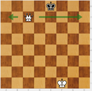

Es hora de que intervenga el rey fuerte, que se acerca tratando de ponerse en la misma columna en la que está el rey encerrado.

|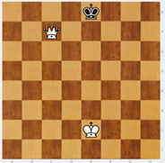|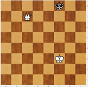|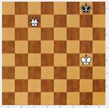|
|---|---|---|
|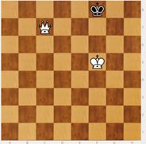|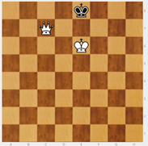|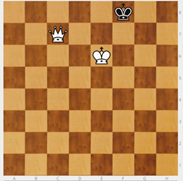|

Una vez acercado el rey, sitúo a la dama entre los dos reyes, dándole un beso.

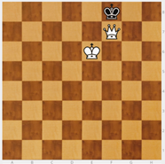

En definitiva, para dar un beso de la muerte:

1. Sitúo mi dama a salto de caballo del rey y voy repitiendo sus movimientos hasta lograr llevarlo al borde del tablero.

2. En cuanto el rey contrario llega a un extremo del tablero, me olvido de poner la dama a salto de caballo, se le corta el paso y queda encerrado: se le hace una "jaula".

3. Subo mi rey hasta situarlo frente al rey contrario.

4. Llevo mi dama a la casilla enfrente del rey contrario, protegida por mi rey, dando jaque mate (beso).

Si me intentan dar un mate con rey y dama, lo único que puedo hacer es llevar corriendo mi rey hasta el borde o a la esquina a ver si me ahogan. En el borde hay muchas posiciones de Ahogado que hay que conocer.

|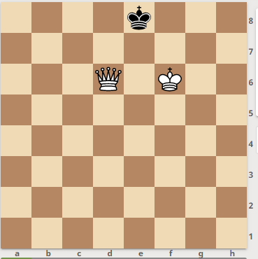 |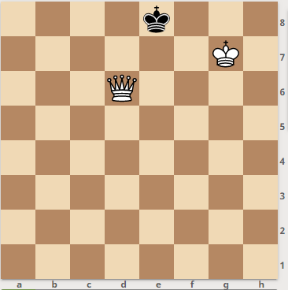|
|---|---|

Pero si la dama está cortando el paso es mucho más difícil ahogar.

Sólo hay un caso: Cuando el rey fuerte se mete dentro de la “jaula”. Si se queda en frente, es imposible.

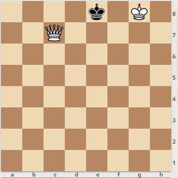
