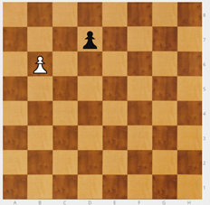
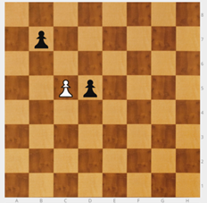
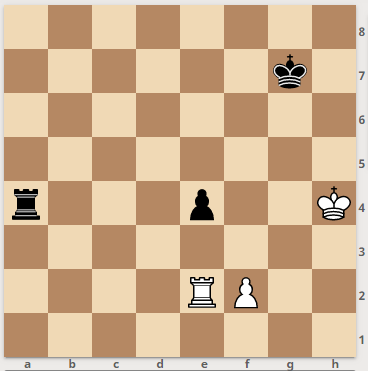

# 2º Movimiento Especial: Péon por peón al paso (a.p.)

Hay que introducir un concepto que a los chicos les cuesta entender y que mucha gente no conoce, **comer al paso**.

Antiguamente el peón solo se movía de 1 en 1, por lo que el peón blanco de c5 controlaba los dos peones negros  de b7 y d7. A partir de introducir la norma de poder avanzar una o dos casillas en el primer movimiento de cada peón, b7 y d7 se podían escapar, lo que resultaba injusto. Para evitarlo, se introdujo la norma que permite al peón blanco comer al paso.

Si uno de los peones negros mueve a b5 o a d5, el peón blanco puede "comer al paso" en la siguiente jugada, colocándose en b6 o d6, respectivamente. Es como si el peón negro  moviera sólo una casilla.

|||
|---|---|
|||

Hay que tener en cuenta que:

- solo los peones pueden comer al paso,

- solo se captura al paso a otro peón

- y solo en la jugada inmediatamente posterior.

### Análisis de un caso

Rey blanco en a4, alfil blanco en f3, torre blanca en f8 y tres peones blancos en a5, b4 y c5; Rey negro en a7, torre negra en e3 y dos peones negros en a6 y b7.

Juegan negras b5 pensando que es jaque mate. Pero el blanco piensa, come al paso en b6 y da jaque mate, esta vez real.

|||
|---|---|

Capturar al paso, aunque parezca que lo entienden, es un concepto difícil y hay que explicarlo y recordarlo con alguna regularidad. Como es un concepto que se usa muy poco, se olvida. Hay que poner pequeños ejercicios para repasarlo.

||||
|---|---|---|

También es bueno recopilar anécdotas de partidas en las que:

- se pudo haber aplicado la idea y no se hizo.

- o en que su aplicación resultó una sorpresa que cambió el resultado esperado.

Para el alumno que lo había olvidado, resulta sorprendente reconocerlo como solución en una poción que de otro modo parecería imposible.

En esta posición el blanco jugó 1. f4 y perdió ¿Por qué?

La jugada que el blanco no consideró fue la captura al paso 1 …, exf3+ a.p. que obliga a defender el jaque. Siguió 2. Rg3, fxe2 con lo que en dos jugadas el blanco perdió su peón y su torre. El negro ganó poco después.
