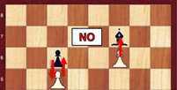
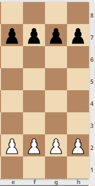
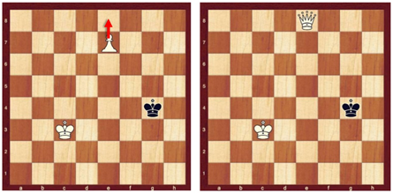
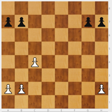
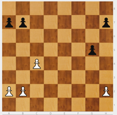
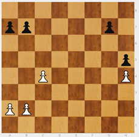
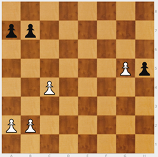

# Peón

Presento el Peón ( ) >>> no se representa con ninguna inicial. Simplemente, se indica la casilla en la que se ubica.

Es la pieza más difícil.

* Cada vez que un peón mueve por primera vez, puede elegir entre avanzar 1 o  2 casillas.
* Siempre avanza por su columna, por su "carril".
* De 1 en 1, salvo el primer movimiento.
* Sólo mueve hacia delante, nunca hacia atrás.

**NOTA**: El hecho de que no pueda retroceder, obliga a ser muy cuidadoso con el movimiento de peones.

* Si se encuentra otra pieza enfrente se queda bloqueado, no puede avanzar ni retroceder.

* Para capturar, lo hace de medio lado avanzando. Cuando captura es el único momento en que el peón puede cambiar de columna.

Todas las piezas capturan como se mueven, salvo el peón.

|||
|---|---|

**NOTA**: La idea de empezar la partida avanzando dos peones diferentes una casilla, no está permitida en el reglamento.

Para practicar el movimiento del peón se pueden jugar “batallas de peones”. En “El pequeño Fritz” se practica un pequeño juego llamado “La batalla de Peonilandia”. Se trata de jugar 4 peones blancos contra 4 peones negros.

En ajedrez hay tres movimientos especiales, dos son de los peones y el otro del Rey.

La coronación del peón es uno de los movimientos especiales.

### 1º Movimiento especial: Coronación o promoción del peón

* Cuando el peón llega al otro extremo del tablero: CORONA. Se cambia por otra pieza (excepto rey o peón). El peón **corona** en la fila final.

Cuando se corona, lo más habitual es pedir una dama, ya que se trata de la pieza más potente.

¿Qué pieza pedimos? Elijo la pieza que quiero. Puedo coronar ocho peones por ocho damas, así que en la práctica podría tener hasta nueve damas. Pero hay que tener mucho cuidado con coronar y cambiar por dama porque se puede ahogar al rey rival. Además hay que enseñar al niño que no se trata de humillar al rival.

Cuando la pieza solicitada en la coronación no es la dama, se habla de una _SUBPROMOCIÓN_.

Al coronar un peón puedo pedir cualquier pieza, aunque no me la hayan matado. Simplemente, se lleva el peón hasta la última casilla y se sustituye por la pieza deseada, esté o no capturada. En competición: a) Si tengo a mano la pieza que se desea coronar, se realiza el cambio y se sigue. b) Si la pieza que se desea (por ejemplo, una nueva dama) no está a mano, se corona, se para el reloj, se levanta la mano para llamar al árbitro y avisarle de que se ha coronado y se desea una nueva pieza; una vez trae la pieza solicitada, se realiza el cambio, se pone de nuevo en marcha el reloj y se continúa la partida.

En ocasiones, entre amigos colocamos una torre al revés simulando una dama, pero hay que tener en cuenta que una torre al revés es una torre al revés.

### Juegos con peones

Para acostumbrar a los chicos a mover los peones, se suelen proponer las "batallas de peones". En la aplicación "Pequeño Fritz" se juega “La batalla de Peonilandia”.

>**info**
>Juego - Cuatro peones blancos contra cuatro peones negros. Gana el que consiga coronar o captura todos los peones del rival. Si corona el blanco y a continuación corona el negro, la partida es empate: tablas. Como siempre empieza el blanco, si corona el negro y a continuación lo hace el blanco, habrá llegado una jugada tarde y pierde. En tal caso, no son tablas.

>

Como puede verse, se juega en medio tablero.

En este tipo de juegos de peones 4 contra 4, tienen un inconveniente: si el negro hace "espejo", es decir copia los movimientos del blanco, gana sin esfuerzo y realmente no ha pensado. Por eso parece mejor hacer batallas de peones con desequilibrios.

>**info**
>Juego - Cuatro peones blancos en a2, b2, c2 y h2; cuatro peones negros en a7, b7, g7 y h7. Gana el que consiga coronar un peón 1º. Si corona el blanco y a continuación corona el negro, la partida es empate: tablas.

>

Este tipo de juegos con desequilibrios permite explicar algunos conceptos importantes que más adelante servirán de orientación en los finales de partida:

* Hay que que atacar dónde se tiene mayoría. En el diagrama de arriba, el blanco debe atacar con sus 3 contra 2. Por el contrario, el negro debería empezar movilizando sus 2 contra 1.
* Para atacar con una mayoría, hay que empezar moviendo el peón que no tiene rival en frente. Dicho peón se llama CANDIDATO. En nuestro ejemplo, el blanco debería empezar con c4, que su peón candidato. El negro tendría que hacer g5, puesto que es su peón candidato.

Por tanto, Peón candidato. Dónde se tiene mayoría, el peón que no tiene rival enfrente.

* ¿Qué pasa si no se empieza con el Candidato?

|||
|---|---|

Si el negro hubiese avanzado h5, entonces el blanco con h4, frena a la mayoría negra de ese ala, porque si hiciese g5, el blanco lo capturaría gratis y el negro perdería su mayoría.

|||
|---|---|
|||

En esta posición, el peón blanco de g5 corona en tres movimientos.

* Si en el ataque con la mayoría, no se empieza con el candidato, surgen importantes posibilidades de que la minoría anule a la mayoría. Evidentemente, para el bando que ataca es un serio inconveniente que puede llevar a perder. Se habla entonces de que la MINORÍA PARA A LA MAYORÍA. Es un recurso defensivo que hay que tener conocer y tener muy presente
* En general, de dos mayorías, es mejor la más pequeña, porque avanza más rápido.
