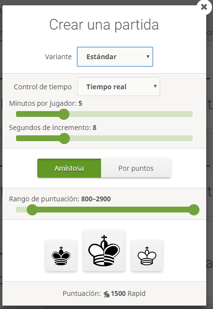
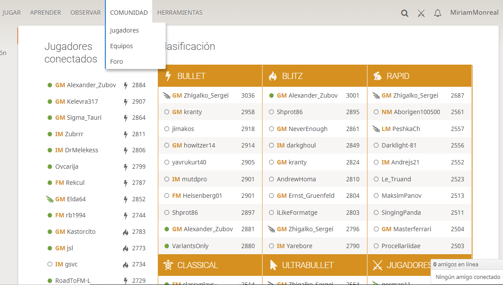

# Recursos informáticos

>**info**
>Si quieres mantenerte en contacto con esta comunidad de ajedrecistas, no olvides unirte al [grupo público de Facebook del programa 'Ajedrez en la Escuela']('Ajedrez en la Escuela')

## [Ajedrez a la escuela](https://www.ajedrezalaescuela.eu/)

Página web de Ajedrez a la escuela: [https://www.ajedrezalaescuela.eu/](https://www.google.com/url?q=https://www.ajedrezalaescuela.eu/&sa=D&ust=1576068136942000)

Es el portal del ajedrez educativo y transversalidades para profes innovadores, que trabajan y llevan el ajedrez a sus aulas. Proporcionamos material a los profes innovadores para que puedan iniciar a sus alumnos en el ajedrez con una progresión adecuada. Trabajamos todas las transversalidades del ajedrez como recursos pedagógico y educativo. Distribuimos noticias de torneos relacionados con el programa y todos aquellos eventos realizados en Aragón relacionados con el Ajedrez escolar. Hacemos reseñas  de material para usar en las aulas de calidad y recomendable. Disponemos de una canal en You Tube donde subimos video tutoriales y mini juegos para que faciliten su uso a todos los interesados.

Entrad e id estudiando sus diferentes secciones. Os servirán de gran ayuda tanto para encontrar recursos para preparar vuestras clases ([https://www.ajedrezalaescuela.eu/ajedrez-escolar/basico/](https://www.ajedrezalaescuela.eu/ajedrez-escolar/basico/)) como para utilizar recursos para todo el centro educativo como es el caso de los Retos Online y en el Hall ([https://www.ajedrezalaescuela.eu/ajedrez-escolar/retos/](https://www.ajedrezalaescuela.eu/ajedrez-escolar/retos/))

## [lichess.org](https://lichess.org)

Es una página web de ajedrez gratuita que nos va a resultar muy útil. A continuación os dejamos las funciones que más nos van a interesar para poder trabajar con nuestros alumnos:

#### Aprendizaje

Encontramos ejercicios por piezas (Chess basics); ejercicios fundamentales de capturas, defensas, salir de jaques, mates en uno...; ejercicios de nivel intermedio de aperturas, capturar al paso, enroques...; ejercicios de nivel avanzado (piece value, check in two). Os dejamos un vídeotutorial del canal youtube de ajedrez a la escuela para que veais como utilizarlo:

https://www.youtube.com/watch?v=gXFnRjJY7Pk&amp;t=416s

Ahora la sección de fundamentos  ya está en castellano y todavía os resultará más sencillo navegar y trabajar en ella.

#### Herramientas

Una sección muy práctica, con un tablero de análisis y el editor de tablero que podemos utilizar como tablero mural con un proyector. También nos permite importar una partida y hacer una búsqueda avanzada de una partida aplicando un gran número de criterios de búsqueda

Os dejamos un video tutorial para que aprendáis a usar el editor de tablero:

https://www.youtube.com/watch?v=kI8DKxVySN4&amp;t=8s

Y otro video tutorial para que veais como crear una partida de ajedrez y cómo analizarla:

https://www.youtube.com/watch?v=8JH9NeeLt5I&amp;t=84s

#### Jugar

Podemos crear una partida e invitar a jugar a alguien, participar en torneos, jugar simultáneas...Incluso crear nuestro propio Torneo y poder jugar con los centros que nosotros queramos y en el horario que mejor nos venga: 

https://www.youtube.com/watch?v=0YT29RpZ1AE&amp;t=16s

#### Observar

Nos permite ver un canal de TV dedicado al ajedrez, observar partidas en directo o acceder a la videoteca con más de mil videos de partidas.

#### Comunidad

Encontramos información sobre los jugadores y equipos de la plataforma, además de un foro y una sección de preguntas y respuestas.

