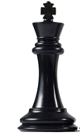
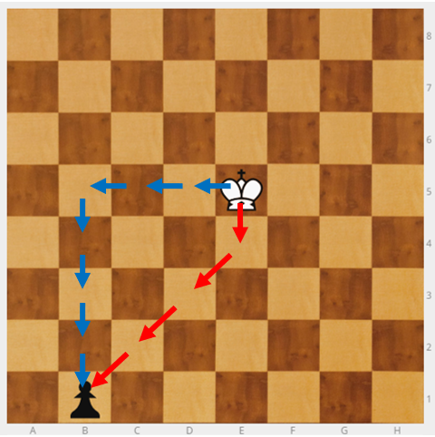
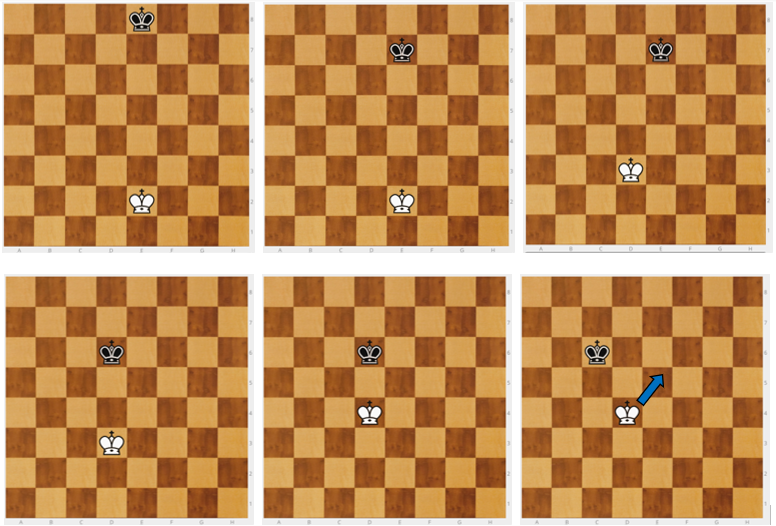

# El Rey

Empezamos por el Rey (R) porque:

* Su movimiento es muy fácil y el más intuitivo: De una en una casilla en todas  las direcciones.
* Como es la pieza más importante, le reconocemos su importancia siendo la primera pieza que enseñamos.

El rey captura como mueve. Al capturar ocupa la casilla de la pieza capturada.

Ponemos el Rey en el tablero y preguntamos a cuántos sitios puede ir. Dependiendo de su posición en el tablero serán:

* Si está en la esquina: 3.
* Si está en un borde: 5.
* Si está en el centro: 8.

>**tip**
>**Ejercicio** - Tengo un Rey y quiero capturar un peón. ¿Cuántos pasos tengo que dar? El peón no mueve. _Recordar que aún no saben mover el peón. El peón es sólo una referencia_.
> Si el movimiento que tiene que hacer el rey es solo en horizontal, vertical o diagonal no hay problema. Cuando el camino que debe seguir no es una línea rectas, al principio, resulta más complicado.

---

>**tip**
>**Ejercicio** - Peón negro en b7, Rey blanco en e5. ¿Cuántos pasos tiene que dar el Rey para comerse al peón?

>

>Son **3** movimientos. Pero los niños dicen suelen decir **5** movimientos las primeras veces, porque van en línea recta.

>En ajedrez la línea recta no siempre es la más rápida.

---

>**tip**
>**Ejercicio** - Peón negro en b1, Rey blanco en e5. ¿Cuántos pasos tiene que dar el Rey para comerse al peón?

>

>Pueden decir que son **7** movimientos, aunque en realidad, para conseguirlo lo antes posible, son **4**.

Aunque creamos que lo entienden, con niños pequeños, hay que repetirlo muchas veces y comprobar que llegan a la respuesta correcta, ya que les resulta más difícil de lo esperado..

Hay que acostumbrar a los alumnos a que lo hagan con la cabeza: Así comenzamos a crear un hábito de CONTROL de la IMPULSIVIDAD. Primero se piensa y luego se coge. Nos referiremos a estos ejercicios, como ejercicios de VISUALIZACIÓN.

Desde el principio hay que hacer las cosas bien. Los ejercicios de visualización son importantes y se les debe dedicar tiempo.

---

>**success**
>NOTA: Si no se dispone de un tablero mural, se puede proyectar desde [es.lichess.org](es.lichess.org). (en el apartado de recursos digitales lo vemos)   Herramientas→ Editor del tablero→ Limpiar tablero

---

>**danger**
>**Norma**: Los reyes no se pueden tocar, tienen que estar separados.

---

>**info**
>**Juego** - Rey contra rey. Coloco los reyes en su posición inicial: Re1 y Re8. El blanco gana si consigue llevar a su Rey hasta la fila 8. El negro gana si consigue impedirlo.

>

Explicar bien que el objetivo del blanco es llegar arriba y del negro  no dejarle pasar. Algunos no lo entienden, llevan el negro hasta la fila 1 y creen que han ganado.

Una vez acabado el juego hay que explicarles cómo ganar. Para ganar el blanco debe coger el mismo color del negro en su columna. Si el negro está en casilla blanca, el blanco va a una casilla blanca de la misma columna. Así siempre gana el blanco. Si el negro le coge el color al blanco en la misma columna, entonces, gana el negro pues no le dejará pasar.

>**danger**
>**Concepto**: Coger la posición. Hay que coger el color del contrario en su misma columna.

Puede que vengan niños diciendo que siempre gana el negro pero, en realidad, siempre gana el blanco: la idea de coger el color resulta una "Jugada invisible". Este tipo de ejercicios dan mucho juego para ejercitar el razonamiento con preguntas del tipo: "¿Qué jugada hace el negro? ¿Y el blanco?". Pregunto por las jugadas buenas. También hay que preguntar por las jugadas malas y que los chicos te expliquen el porqué. Uso el ajedrez para hacer razonamiento lógico.

Para involucrar a las familias y que sigan practicando en casa: "Ya sabes el truco, sabes ganar con blancas y negras. Llega a casa y juégate algo con tus padres". Así se consigue involucrar a las familias y que sigan practicando en casa.

