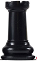
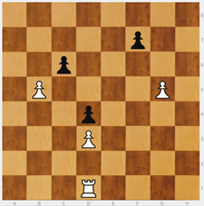
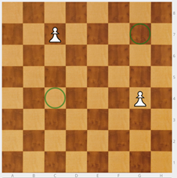

# Torre

Presento la Torre (T): Primero, cómo se mueve: en línea recta, como el signo de sumar, y todos los cuadrados que quiera. La torre captura de la misma forma que mueve.

Primera sorpresa: da igual dónde esté la torre, en un tablero vacío domina 14 casillas SIEMPRE.

Importante cómo secuenciar los ejercicios:

* Para aprender no quiero restricciones: No empiezo con ejercicios de a cuántas casillas puede ir la torre, y la torre restringida por piezas propias y rivales.
* Empiezo con ejercicios de comer peones de forma directa (en un movimiento) o con una maniobra (en dos o más movimientos).
* Colocar una Torre blanca en, por ejemplo en h1, y varios peones negros desperdigados por el tablero mural. Ver cómo podemos capturarlos todos.

NOTA:Si proponemos una posición en el tablero mural, pedir que la copien en el tablero de mesa, puede resultar bastante complicado para niños pequeños que se están iniciando.

>**tip**
>**Ejercicio** - Por parejas: uno coloca la Torre en una esquina y su compañero los peones del color contrario donde quiera. Hay que capturarlos todos. El que ha colocado los peones, vigila que los movimientos de torre se hagan correctamente..

---

>**tip**
>**Ejercicio** - Torre blanca en h1, peones negros en h5, h6 y g6. Quiero comerme primero a h6. ¿Cuántos movimientos necesito? Puedo hacerlo en 4 movimientos.

>

Hay que trabajar las visualizaciones. Buscar distintos caminos. Da igual el número de movimientos. No hay un camino único sino muchos. Que vean otras opciones siempre es enriquecedor.

El siguiente paso es poner obstáculos con peones del mismo color que la torre. Si mezclo peones blancos y negros creo laberintos y tienen que buscar los caminos que les permitan llegar a realizar las capturas. Que expliquen el camino que han encontrado está muy bien; que busquen caminos nuevos, aún mejor. No se necesita un libro para inventar este tipo de ejercicios.

>**tip**
>**Ejercicio** - Torre blanca en d1, tres peones blancos en b5, d2 y g5, y tres peones negros en c6, d4 y f7. La torre tiene que comerse a los peones negros.

>

----

>**info**
>Juego - Comerse los peones del rival. Se colocan una Torre blanca en h1 y una Torre negra en a8; además, cada bando coloca tres (o más)de sus peones distribuidos por el tablero. Hay que comerse los peones contrarios. Si el blanco se come el último peón e inmediatamente el negro también se come el último blanco, es empate. No se pueden comer las torres.

>
Este juego requiere más precisión pero realmente aún no hay rival, cada uno va a lo suyo.

>

---

>**danger**
>**Norma**: Darse la mano antes de comenzar a jugar.
>RECORDAR ANTES DE EMPEZAR: Mi rival no es mi enemigo, es otro niño que viene a pasárselo bien jugando conmigo. Cuando juego progreso. Mi rival es necesario, vamos a crecer juntos. Juego, gano, pierdo... ¡da igual! Me divierto y voy mejorando.

**OBSERVACIÓN**: Cuando los niños salen a jugar competiciones, encuentros... la autoestima se machaca muchísimo, hay mucha tensión. Si pierdo, pierdo yo. Hay que decir a los chicos: "Si pierdes, APRENDE DE TUS FALLOS. Y no te voy a querer menos porque pierdas. Sigue, mejora, las victorias llegarán." Es muy importante para evitar abandonos.

La progresión adecuada de los ejercicios es la siguiente:

1. Capturar piezas sueltas (peones) >>> VISIÓN SIN RIVAL.
2. Capturar piezas en laberinto >>> VISIÓN SIN RIVAL.
3. Capturar piezas y el rival también >>> VISIÓN CON RIVAL "LIGHT". La velocidad del rival es el reto a superar.
4. Puedo capturar a la pieza rival que captura >>> HAGO VISIBLE AL RIVAL. Aparece el rival.

>**tip**
>Ejercicio - Colocar una Torre que ataque a dos peones a la vez. Peones blancos en c7 y g4\. ¿Dónde coloco una Torre que ataque a ambos? En c4 y g7.

>

Hay que hacer estos ejercicios. Al hacerlos descubrimos que hay niños que tienen muchas dificultades.
